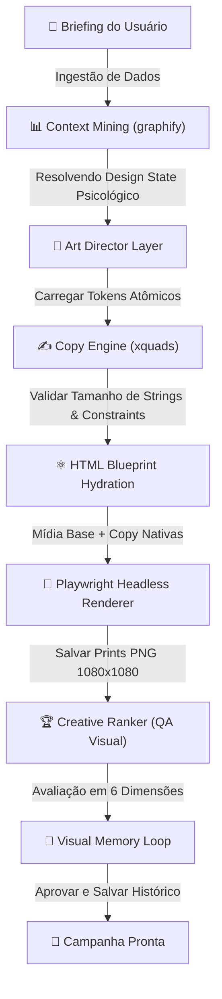

# 📑 JarvisAgency OS — Manifesto de Arquitetura do Creative OS

Este manifesto documenta o fluxo de dados, as diretrizes de design e os motores integrados do **Creative OS**, o sistema determinístico de geração de criativos de alta conversão do JarvisAgency OS.

---

## 🗺️ Fluxograma do Pipeline (Mermaid.js)

---

## 📊 Estrutura e Divisão em 5 Camadas

Para erradicar designs caóticos gerados por IA, o Creative OS isola a criação em camadas determinísticas de código e design gráfico clássico:

| Camada | Tecnologia | Responsabilidade |
| :--- | :--- | :--- |
| **1. Art Director Layer** | `design_states.json` + `constraints.json` | Mapeia nichos comerciais para 5 estados psicológicos. Determina as paletas de cores (background, card, destaque), fontes nativas e regras rígidas de contraste e margens. |
| **2. Copy Engine** | `xquads/engine.py` | Redige múltiplos ângulos de copy aplicando restrições de tamanho (max 60 caracteres para headlines) para evitar quebras de layout. |
| **3. Structure Engine** | `jarvis_agency_os/blueprints/` | Blueprints HTML semânticos e imutáveis com layouts travados (Split Grid, Glassmorphism, Cinematic). O layout final nunca é deixado para a livre interpretação da IA. |
| **4. Render & QA Layer** | Playwright + `ranker.py` | Renderiza nativamente o HTML em PNG de altíssima definição (1080x1080). Avalia se a peça gerada cumpre acessibilidade de contraste, densidade de elementos eCTA visível. |
| **5. Feedback Loop** | `visual_memory.py` | Armazena dados de engajamento e aprovação de campanhas anteriores em JSON para otimizar escolhas de layouts automáticos em execuções futuras. |

---

## Posts Profissionais

Posts de feed/story nao devem ser entregues como HTML final. O HTML em `workspace/generated_creatives/` e apenas o arquivo-fonte deterministico. A entrega visual deve ser o PNG renderizado em `workspace/project_images/<project_slug>/renders/` ou o pacote final em `workspace/project_images/<project_slug>/exports/`.

Para nichos genericos, os templates `feed_professional_photo.html` e `story_professional_photo.html` sao priorizados. Eles usam composicao image-first, foto full-bleed, overlay editorial, hierarquia curta e CTA forte para evitar arte com aparencia de card HTML amador.

---

## Landing Pages Atualizadas

As landpages de desenvolvimento em `development_landpages/` sao apenas prototipos de analise visual. Para uma landing sair pelo pipeline oficial, o modelo deve usar `jarvis_agency_os/landing_engine.py`, que hidrata os blueprints em `jarvis_agency_os/blueprints/`.

As regras de pasta estao consolidadas em `OUTPUT_CONVENTIONS.md`. Antes de criar uma nova pagina ou imagem, o modelo deve decidir se ela e prototipo, blueprint oficial, asset de campanha, imagem gerada ou saida do pipeline.

Rotas ativas no gerador:

| Nicho detectado | Blueprint oficial |
| :--- | :--- |
| Marketing, growth, midia, performance, trafego | `landing_marketing_agency.html` |
| Turismo, viagens, roteiro, hotel, pacote | `landing_tourism_agency.html` |
| Educacao, pedagogico, reforco, infantil | `landing_education_premium.html` |
| Advocacia, juridico, direito, legal | `landing_legal_premium.html` |
| Demais nichos | `landing_premium_agency.html` |

Qualquer modelo externo que gerar landpage copiando `landing_premium_agency.html` para marketing ou turismo esta usando o estilo anterior e deve ser corrigido para chamar `generate_landing_page()`.

---

## ⚙️ Regra de Ouro da Geração Visual

> 🚨 **A IA visual nunca pode gerar o anúncio final.** Ela é responsável exclusivamente pelo fornecimento do asset fotográfico isolado ( background / fotografia sem textos ). Todo o layout do anúncio, headlines, logos e CTAs são montados programaticamente via HTML/CSS e fontes vetoriais nativas.
