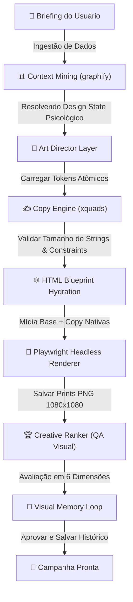

# 📑 JarvisAgency OS — Manifesto de Arquitetura do Creative OS

Este manifesto documenta o fluxo de dados, as diretrizes de design e os motores integrados do **Creative OS**, o sistema determinístico de geração de criativos de alta conversão do JarvisAgency OS.

---

## 🗺️ Fluxograma do Pipeline (Mermaid.js)

---

## 📊 Estrutura e Divisão em 5 Camadas

Para erradicar designs caóticos gerados por IA, o Creative OS isola a criação em camadas determinísticas de código e design gráfico clássico:

| Camada | Tecnologia | Responsabilidade |
| :--- | :--- | :--- |
| **1. Art Director Layer** | `design_states.json` + `constraints.json` | Mapeia nichos comerciais para 5 estados psicológicos. Determina as paletas de cores (background, card, destaque), fontes nativas e regras rígidas de contraste e margens. |
| **2. Copy Engine** | `xquads/engine.py` | Redige múltiplos ângulos de copy aplicando restrições de tamanho (max 60 caracteres para headlines) para evitar quebras de layout. |
| **3. Structure Engine** | `jarvis_agency_os/blueprints/` | Blueprints HTML semânticos e imutáveis com layouts travados (Split Grid, Glassmorphism, Cinematic). O layout final nunca é deixado para a livre interpretação da IA. |
| **4. Render & QA Layer** | Playwright + `ranker.py` | Renderiza nativamente o HTML em PNG de altíssima definição (1080x1080). Avalia se a peça gerada cumpre acessibilidade de contraste, densidade de elementos eCTA visível. |
| **5. Feedback Loop** | `visual_memory.py` | Armazena dados de engajamento e aprovação de campanhas anteriores em JSON para otimizar escolhas de layouts automáticos em execuções futuras. |

---

## ⚙️ Regra de Ouro da Geração Visual

> 🚨 **A IA visual nunca pode gerar o anúncio final.** Ela é responsável exclusivamente pelo fornecimento do asset fotográfico isolado ( background / fotografia sem textos ). Todo o layout do anúncio, headlines, logos e CTAs são montados programaticamente via HTML/CSS e fontes vetoriais nativas.
